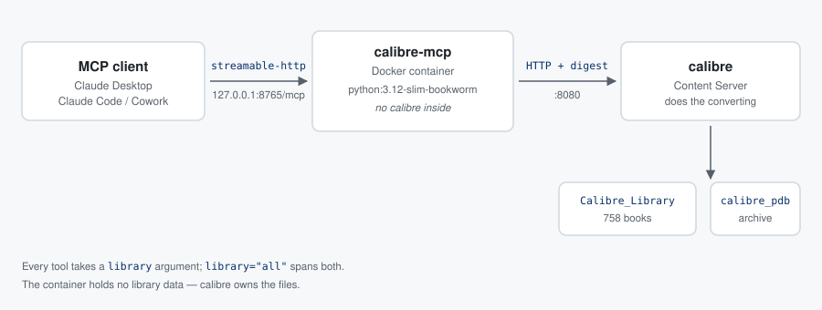
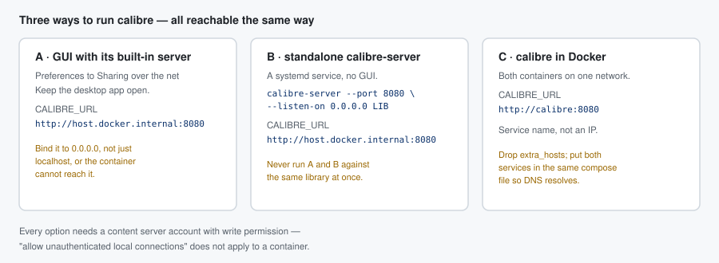
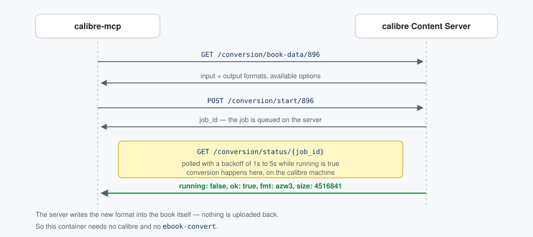

# calibre-mcp

An MCP server that drives a running **calibre Content Server** over its HTTP
API: search a library, edit metadata, and convert books to other formats —
from Claude or any other MCP client.

It does not touch `metadata.db` and does not drive `calibredb` against the
library folder, so the calibre GUI can stay open and the library can live on
another machine entirely.



---

## Read this first

Three things trip everyone up. Getting them right takes two minutes; getting
them wrong costs an hour.

### 1. You need a content server account

calibre's **"allow unauthenticated local connections to make changes"** does
**not** work for a container. The container reaches calibre from the Docker
bridge network (`172.x.x.x`), which calibre does not consider a local
connection, so writes are refused no matter how that option is set.

This was confirmed the hard way: reads worked perfectly and everything looked
healthy right up to the first write.

Create a real account instead:

```bash
calibre-server --manage-users        # standalone server
```

or in the GUI: **Preferences → Sharing over the net → User accounts**.

### 2. That account needs write permission

A read-only account gets through the login and then fails on any change with
HTTP 403. In the user manager, give the account write access to the libraries
you intend to modify.

### 3. Name the library explicitly

A calibre server can host several libraries, and **its default may not be the
one you want**. On the machine this was built against, the server's own
default was `calibre_pdb` — a side archive — while the real collection is
`Calibre_Library`.

So `CALIBRE_LIBRARY_ID` is set explicitly:

```yaml
CALIBRE_LIBRARY_ID: "Calibre_Library"
```

Leave it empty and every call silently lands in whatever the server considers
default. Run `list_libraries` to see the real ids — they are the ids, not the
display names.

---

## Features

- **All libraries at once** — every tool takes a `library` argument, and
  `library="all"` spans the whole installation. One server, no matter how
  many libraries.
- **Read** — calibre query syntax, full metadata, per-library and
  cross-library search, format breakdowns, file download.
- **Edit** — metadata, add books, attach formats, copy or move books between
  libraries.
- **Convert** — server-side, through calibre's own conversion queue.

## Requirements

- A running calibre Content Server with an account that may write
- Docker, or Python 3.10+ to run it directly

Nothing else. No local calibre, no `ebook-convert`.

---

## Setting up calibre



### A. The server built into the GUI

Best when you want the desktop app open anyway.

1. **Preferences → Sharing over the net**
2. Enable the server, port `8080`
3. Tick *Run server automatically when calibre starts*
4. Add a user with write permission under **User accounts**

Make sure it listens on all interfaces, not only `127.0.0.1`, or the
container cannot reach it.

### B. Standalone `calibre-server`

```bash
calibre-server --port 8080 --listen-on 0.0.0.0 \
               --enable-auth ~/Calibre\ Library
```

As a user service:

```ini
# ~/.config/systemd/user/calibre-server.service
[Unit]
Description=Calibre Content Server
After=network.target

[Service]
ExecStart=/usr/bin/calibre-server --port 8080 --listen-on 0.0.0.0 \
          --enable-auth %h/Calibre Library
Restart=on-failure

[Install]
WantedBy=default.target
```

```bash
systemctl --user daemon-reload && systemctl --user enable --now calibre-server
```

> **Never run A and B against the same library at the same time.** Two
> processes owning one library is how it gets corrupted.

### C. calibre in Docker

Put both services in one compose file so Docker's DNS resolves the name:

```yaml
services:
  calibre:
    image: lscr.io/linuxserver/calibre:latest
    environment: [PUID=1000, PGID=1000, TZ=Europe/Prague]
    volumes:
      - ./calibre-config:/config
      - ./books:/books
    ports: ["8080:8081"]     # check the image's own port mapping
    restart: unless-stopped

  calibre-mcp:
    build: .
    environment:
      CALIBRE_URL: "http://calibre:8080"   # service name, not an IP
      CALIBRE_LIBRARY_ID: "Calibre_Library"
      CALIBRE_USER: "${CALIBRE_USER}"
      CALIBRE_PASSWORD: "${CALIBRE_PASSWORD}"
      MCP_TRANSPORT: "streamable-http"
    ports: ["127.0.0.1:8765:8765"]
    depends_on: [calibre]
```

With calibre in the same compose project, drop `extra_hosts` — the container
reaches it by service name.

### Check it answers

```bash
curl -s -u user:pass --digest http://localhost:8080/ajax/library-info | python3 -m json.tool
```

The `library_map` keys are the ids for `CALIBRE_LIBRARY_ID`.

---

## Running the container

```bash
git clone git@github.com:opentreecz/calibre-mcp.git
cd calibre-mcp

cp .env.example .env        # fill in CALIBRE_USER and CALIBRE_PASSWORD
$EDITOR .env

docker compose build
docker compose up -d
docker compose logs -f
```

The image is Debian stable (bookworm) with Python 3.12, runs as a non-root
user, and contains no calibre.

Credentials live in `.env`, which is gitignored — `docker-compose.yml` only
interpolates them, so no password ends up in the repository.

Start with `CALIBRE_READONLY=1` (the default in `.env.example`). Once reads
look right, set it to `0` and re-run `docker compose up -d`.

---

## Adding it to Claude

The container speaks **streamable-http** on `http://127.0.0.1:8765/mcp`.

### Claude Code / Cowork

```bash
claude mcp add --transport http calibre http://127.0.0.1:8765/mcp
claude mcp list
```

### Claude Desktop

`~/.config/Claude/claude_desktop_config.json` on Linux,
`~/Library/Application Support/Claude/claude_desktop_config.json` on macOS:

```json
{
  "mcpServers": {
    "calibre": {
      "type": "streamable-http",
      "url": "http://127.0.0.1:8765/mcp"
    }
  }
}
```

Restart Claude Desktop afterwards. Older builds only speak stdio — use the
variant below if the server does not appear.

### Any client, via stdio

This works everywhere and needs no long-running container: the client starts
one per session and it exits with the client.

```json
{
  "mcpServers": {
    "calibre": {
      "command": "docker",
      "args": [
        "run", "--rm", "-i",
        "--add-host=host.docker.internal:host-gateway",
        "-e", "MCP_TRANSPORT=stdio",
        "-e", "CALIBRE_URL=http://host.docker.internal:8080",
        "-e", "CALIBRE_LIBRARY_ID=Calibre_Library",
        "-e", "CALIBRE_USER=yourname",
        "-e", "CALIBRE_PASSWORD=yourpassword",
        "calibre-mcp:latest"
      ]
    }
  }
}
```

Build the image once with `docker compose build`; you do not need
`docker compose up` for this mode.

### Without Docker

```bash
python3 -m venv .venv && .venv/bin/pip install -r requirements.txt
```

```json
{
  "mcpServers": {
    "calibre": {
      "command": "/abs/path/calibre-mcp/.venv/bin/python",
      "args": ["/abs/path/calibre-mcp/calibre_mcp.py"],
      "env": {
        "CALIBRE_URL": "http://localhost:8080",
        "CALIBRE_LIBRARY_ID": "Calibre_Library",
        "CALIBRE_USER": "yourname",
        "CALIBRE_PASSWORD": "yourpassword"
      }
    }
  }
}
```

Paths must be absolute — `~` is not expanded.

### Check it end to end

```bash
python3 scripts/smoke.py                    # read-only
python3 scripts/smoke.py --convert 896:azw3 # also converts one book
```

Then just ask Claude: *"how many books are in my calibre library?"* or
*"convert Robinson Crusoe to azw3"*.

---

## Working with several libraries

There is no need to run one server per library.

```
search_books(query="author:Capek")                    default library
search_books(query="manual", library="calibre_pdb")   a named library
search_books(query="Maj", library="all")              every library
libraries_overview()                                  counts for all of them
copy_to_library(book_ids=[7], target_library="Calibre_Library",
                library="calibre_pdb")
```

`library="all"` works on `search_books` and `library_stats`. It is refused
elsewhere on purpose: a book id belongs to exactly one library, so the tool
makes you name it rather than guessing.

An unknown id returns the list of valid ones instead of a bare 404.

---

## Tools

| Tool | Purpose |
|---|---|
| `list_libraries` | libraries on the server and their ids |
| `search_books` | search one library, or all with `library="all"` |
| `search_all_libraries` | search every library, results kept separate |
| `get_book` | full metadata for one book |
| `library_stats` | book count and format breakdown |
| `libraries_overview` | the same for every library, plus a combined total |
| `download_book` | download a book file to a directory |
| `set_metadata` | title, authors, tags, series, rating, custom columns |
| `add_book` | upload a file as a new book |
| `add_format` | attach another format to an existing book |
| `copy_to_library` | copy or move books between libraries |
| `conversion_options` | formats and options a book supports |
| `convert_book` | queue a conversion on the server and wait |
| `conversion_job_status` | poll or abort a job started with `wait=False` |

Deleting books is deliberately not implemented, although
`/cdb/delete-books` exists. An irreversible operation fired by accident from
a chat is a bad idea.

---

## Conversion



calibre does the work. This client asks what is possible, queues the job,
and polls until it finishes; the server adds the resulting format to the
book itself.

```
conversion_options(book_id=896)
convert_book(book_id=896, to_format="azw3")
convert_book(book_id=896, to_format="epub", options={"smarten_punctuation": True})
convert_book(book_id=896, to_format="pdf", wait=False)   # returns a job id
```

A real run: book 896 from EPUB to AZW3 took about nine seconds and produced
4.5 MB, and the new format appeared in the book on its own.

---

## Configuration

| Variable | Meaning |
|---|---|
| `CALIBRE_URL` | **required**, e.g. `http://host.docker.internal:8080` |
| `CALIBRE_LIBRARY_ID` | default library — **set this explicitly** |
| `CALIBRE_USER` / `CALIBRE_PASSWORD` | account with write permission |
| `CALIBRE_AUTH` | `digest` (calibre's default) \| `basic` \| `none` |
| `CALIBRE_READONLY` | `1` disables every write tool |
| `CALIBRE_TIMEOUT` | HTTP timeout in seconds (default 120) |
| `CALIBRE_VERIFY_TLS` | `0` skips certificate checks (self-signed on a LAN) |
| `MCP_TRANSPORT` | `stdio` (default) \| `streamable-http` \| `sse` |
| `MCP_HOST` / `MCP_PORT` / `MCP_PATH` | HTTP bind settings |

Behind a reverse proxy calibre is usually switched to basic auth
(`--auth-mode=basic`); set `CALIBRE_AUTH=basic` to match.

---

## Tests

```bash
.venv/bin/python -m pytest tests/ -v
```

`tests/` contains a mock Content Server with two libraries covering every
endpoint used, including the conversion job lifecycle. 22 tests.

The mock checks client logic — URL construction, JSON shapes, base64
encoding, library routing. It is not a substitute for a real server: back up
`metadata.db` and start with `CALIBRE_READONLY=1`.

---

## Endpoints used

Verified against the calibre sources in `src/calibre/srv/`:

```
GET  /ajax/library-info
GET  /ajax/search/{lib}?query=&num=&offset=&sort=&sort_order=
GET  /ajax/books/{lib}?ids=1,2,3
GET  /ajax/book/{id}/{lib}
GET  /get/{fmt}/{id}/{lib}
POST /cdb/set-fields/{id}/{lib}
POST /cdb/add-book/{job}/{dup}/{filename}/{lib}
POST /cdb/copy-to-library/{target}/{lib}
GET  /conversion/book-data/{id}?library_id=
POST /conversion/start/{id}?library_id=
GET  /conversion/status/{job}?library_id=
```

Two quirks worth knowing. `/conversion/*` takes the library as a **query
parameter**, while `/ajax/*` and `/cdb/*` take it as a **path segment**. And
attaching a format has no endpoint of its own — it goes through `set-fields`
under the special `added_formats` key, the file passed as a base64 data URL.

---

## Troubleshooting

| Symptom | Cause |
|---|---|
| `CALIBRE_URL is not set` | the client passed no environment |
| `401` | wrong credentials, or `CALIBRE_AUTH` set to the wrong scheme |
| `403` | the account may not write — see *Read this first* |
| `Connection failed` | calibre bound to `127.0.0.1`, or the wrong port |
| `Server did not return JSON` | `CALIBRE_URL` points at something else |
| empty results | wrong `CALIBRE_LIBRARY_ID`; check `list_libraries` |
| tools missing in the client | client restarted? absolute paths? |

Quick check that bypasses MCP entirely:

```bash
docker compose exec calibre-mcp python -c "
import urllib.request, os
print(urllib.request.urlopen(os.environ['CALIBRE_URL'] + '/ajax/library-info',
                             timeout=10).read().decode()[:300])"
```

If that fails the problem is the network or calibre, not this server.

---

## Docs

- [Návod v češtině](docs/navod-cs.md)

## License

AGPL-3.0
